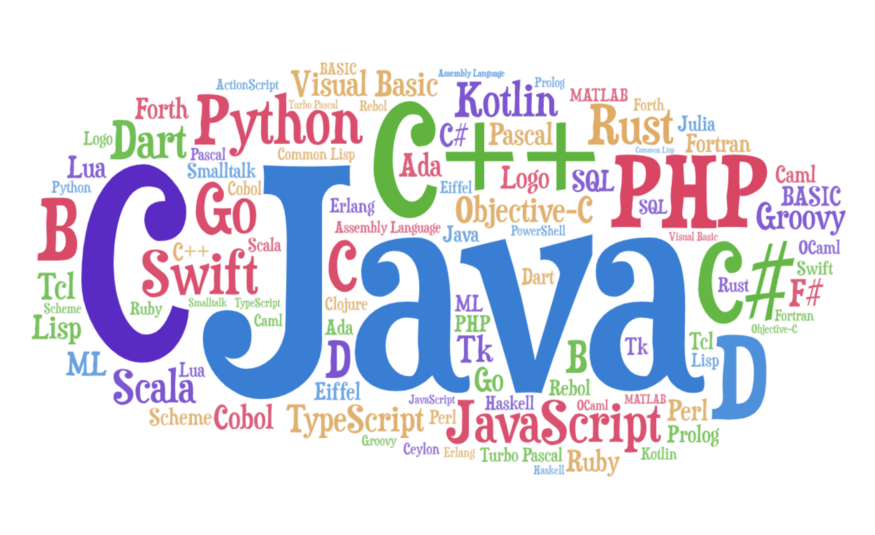

1장 프로그래밍

1.1 프로그래밍이란?

    1) 컴퓨터에게 실행을 요구하는 일종의 커뮤니케이션 => 요구사항을 명확히 이해한 후 적절한 문제 해결 방안을 정의
        - 문제 해결 능력 요구
        - 기계가 실행할 수 있을 정도로 정확하고 상세하게 요구사항을 설명하는 작업 => 코드
        - 컴퓨팅 사고(Computational thinking)

1.2 프로그래밍 언어

    1) 프로그래밍 언어
        - 컴퓨터가 이해할 수 있는 기계어로 변환하는 일종의 번역기
        - 컴파일러, 인터프리터

1.3 구문과 의미

    1) 문법에 맞는 문장 구성과 의미를 갖고 있어야 언어의 역할을 충실히 수행할 수 있다. => 요구사항이 실현 (문제가 해결)
    2) 변수와 값, 키워드, 연산자, 표현식과 문, 조건문, 반복문에 의한 흐름제어, 함수, 객체, 배열 같은 문법 제공
    3) 프로그래밍은 요구사항의 집합을 분석해 적절한 자료구조와 함수의 집합으로 변환한 후, 그 흐름을 제어

    
